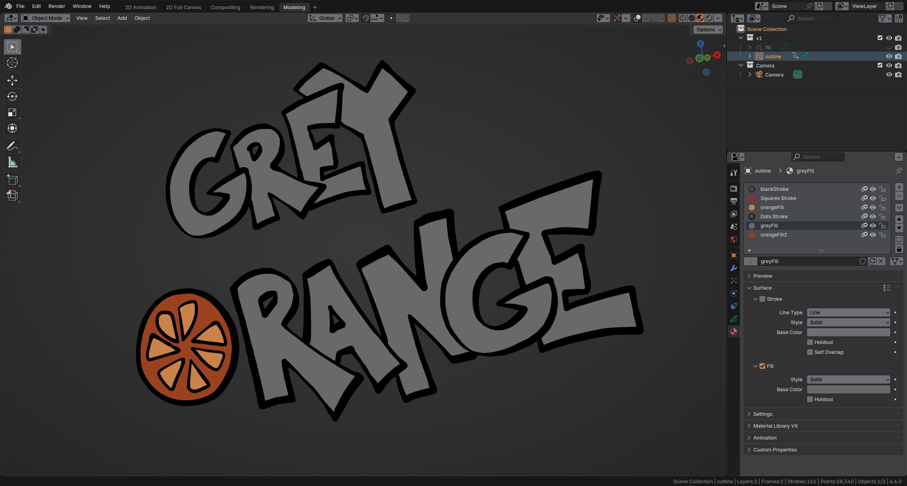
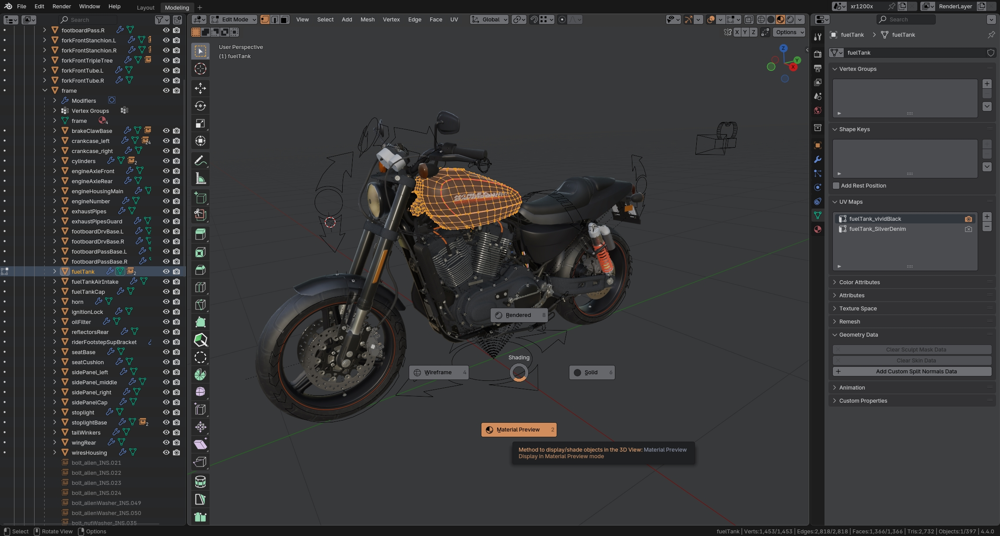
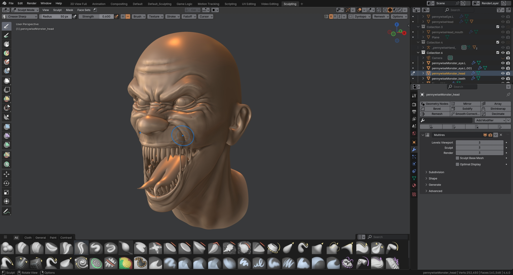
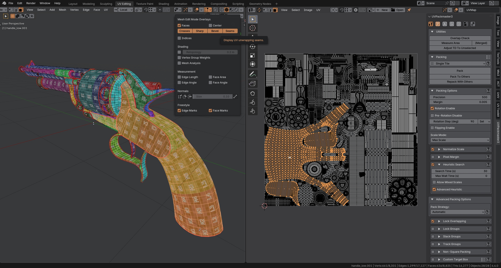
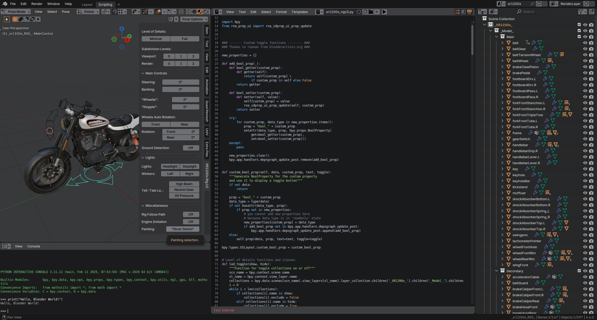

Dark neutral grey Blender's interface theme with orange accents.

## Installation

This theme is available on [Blender's Extensions platform](https://extensions.blender.org/themes/grey-orange/)

(Optional):
1. Clone or download ZIP
2. (optional) Extract .zip
3. Open Blender User Preferences (Themes tab)
4. Click "Install Theme..." and select **grey_orange.xml** file

## Some screenshots

